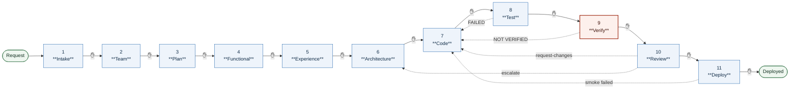

# The Conclave Pipeline — canonical definition

**This file is the source of truth for the pipeline's *shape*.**
`admin/MAS_REGISTRY.md` remains the source of truth for *who* each agent is.
`.claude/skills/new-project/SKILL.md` is the executable form of this order —
if the two ever disagree, this file and the registry win, and the skill is the
one to correct.

Maintained by the **orchestrator** (see `admin/ORCHESTRATOR.md`). Any change to
gate order, gate ownership, or approval authority goes through `mas-architect`
review and human approval first, exactly like an agent contract.

---

## 1. The pipeline

Eleven gates. Every arrow marked ✋ is a **human approval that cannot be
skipped**. A gate never advances on the orchestrator's own judgement.

**Layout is left-to-right.** A pipeline reads as a journey, and a journey reads
along the page, not down it. Every progress graph in this platform uses
`flowchart LR` — the whole point is that the human sees distance travelled at a
glance.



Gate owners and artifacts are in the table below rather than in the node
labels — at eleven nodes across, long labels make the graph unreadable, and the
graph's job is position-at-a-glance, not reference.

**Dotted arrows are the loops.** They are not exceptions — they are the normal
operation of a pipeline that is actually checking anything. A run with no
loop-backs is more likely to mean the checks are weak than that the code was
perfect.

---

## 2. Gate reference

| # | Gate | Owner (final say) | Human checkpoint | Exit criteria | Loops back to |
|---|------|-------------------|------------------|---------------|---------------|
| 1 | Intake | orchestrator | Confirm domain + industry | `DOMAIN_KB.md`, `INDUSTRY_KB.md` seeded | — |
| 2 | Team Composition | orchestrator | **Approve roster + Test Policy** | Roster in `PROJECT_CONTEXT.md`; cost estimate shown | — |
| 3 | Plan & Backlog | plan-agent | **Approve MVP scope** (per-feature checkboxes) | `PLAN.md`; approved backlog in `FEATURES.md` | — |
| 4 | Functional Design | functional-design-agent | Approve acceptance criteria | `FUNCTIONAL_SPEC.md`, every AC carrying a stable ID | 3 |
| 5 | Experience Design | ui-ux-designer | **Approve from a rendered mockup**, never spec text | `UX_KB.md`; mockup in `design-review/` | 4 |
| 6 | Architecture | solution-architect + security-architect (joint) | Approve design + Impact Analysis | `ARCHITECTURE_KB.md` incl. blast radius; `SECURITY_KB.md` | 5 |
| 7 | Code | code-agent | Approve implementation summary | Commits; unit + reachability tests in the same commit | 6 |
| 8 | Test | test-agent | Approve per-suite report | Every suite `EXECUTED`; blocking suites pass | **7** |
| 9 | **Verification** | verification-agent | Approve evidence matrix | Every `AC-*` → named executed passing check | **7** |
| 10 | Review | review-agent | Approve verdict | `approve` (not `request-changes`/`escalate`) | **7** or 6 |
| 11 | Deploy | deploy-agent | Approve deployment | App up; smoke test passes | 7 |

### Gates that may be skipped, and how

- **5 · Experience Design** — not applicable to `agentic-workflow` (no UI).
  Skipped by template, recorded, not silently omitted.
- **Any gate whose only active SMEs were dropped** at Team Composition still
  "runs" in the sense that its absence is written into `PROJECT_CONTEXT.md`.
  An unreviewed gate must be visible later, never absent.
- **Nothing else.** A gate skipped for any other reason is a **human
  exception**: explicitly requested, explicitly approved, and recorded in the
  Decisions Log with its reason. The orchestrator may not grant itself one.

---

## 3. Progress notation

The orchestrator re-renders the graph **at every gate**, using these states.
The notation is deliberately small — five states, one glyph each.

| Glyph | State | Meaning |
|-------|-------|---------|
| `✅` | `done` | Gate closed, human approved |
| `▶` | `active` | Currently running, or awaiting human approval |
| `↩` | `looped` | Failed and sent work back; will re-run |
| `⬜` | `pending` | Not started |
| `⊘` | `skipped` | N/A for this template, or SMEs dropped — recorded |

Mermaid class definitions to reuse verbatim, so every render looks the same:

```
classDef done    fill:#eef6ef,stroke:#2f6f43,color:#123021
classDef active  fill:#fff8e6,stroke:#8a6410,stroke-width:2px,color:#3d2c04
classDef looped  fill:#fdf0ec,stroke:#a3341f,stroke-width:2px,color:#3d1109
classDef pending fill:#f4f5f7,stroke:#b8bfc9,color:#767f8d
classDef skipped fill:#f4f5f7,stroke:#b8bfc9,color:#767f8d,stroke-dasharray:4 3
```

---

## 3a. Mandatory gate report-out

**Every gate ends with a visual report-out. This is not optional and it is not
conditional on the human asking.** A gate that closes without one has not
closed correctly.

The report-out is always these five parts, in this order:

1. **Position** — gate number and name, and whether it is running, awaiting
   approval, or blocked.
2. **The graph** — left-to-right, current state, using §3's notation and
   `classDef` block verbatim.
3. **What this gate produced** — artifacts, by path.
4. **What was skipped and why**, if anything — and `⊘ not applicable`,
   `⊘ gate did not exist`, and `⊘ skipped without exception` must be
   distinguished. They look identical in a graph and are entirely different
   facts.
5. **What is being asked** — the specific approval decision, and what happens
   on each answer.

Then, and only then, the approval question.

**Why mandatory.** The failure this prevents is not the human being uninformed
— it is the human being *asked to approve something whose position they cannot
see*. An approval given without knowing which gates were skipped to arrive
there is not informed consent, and the F18 build produced exactly that: gates
skipped, work approved, and the omission invisible until a human found seven
defects by hand on the running app.

## 4. The orchestrator's obligations

1. **Create** `projects/<name>/PIPELINE_LOG.md` at project start, from
   `admin/templates/PIPELINE_LOG_TEMPLATE.md`.
2. **Render the graph at every gate**, before asking for approval — current
   state, what was just produced, what comes next. The human should never have
   to ask "where are we?"
3. **Log the row** on every gate close: gate, date, participants, artifacts,
   approval, and any exception with its reason.
4. **Redraw on any change of shape.** A mid-flight scope change, an
   enhancement, a re-opened gate, or an SME re-engagement all change the
   route. The graph must show the route actually being taken, not the one
   planned at the start. A stale graph is worse than none — it asserts
   something false.
5. **Never mark a gate `done` that the human did not approve.** The log is
   evidence; if it can be written optimistically it is worth nothing.

**Why the log exists.** During the F18 mobile build the orchestrator skipped
gates and nothing detected it, because the only party who could see the
omission was the party making it. `PIPELINE_LOG.md` makes non-compliance
visible to someone else — `review-agent` at Review, `release-manager` at
`/cut-release`, and the human at any point. That is the entire design intent:
not another rule, but a record that makes the existing rules checkable.

---

## 5. Related files

- `admin/MAS_REGISTRY.md` — who each agent is, its gate, tools, version
- `admin/ORCHESTRATOR.md` — the orchestrator's own contract
- `admin/samples/PIPELINE_WALKTHROUGH.md` — a full worked run, including a
  failing Test loop, a `NOT VERIFIED` loop, a `request-changes` loop, and a
  mid-enhancement redraw
- `admin/templates/PIPELINE_LOG_TEMPLATE.md` — the per-project tracker
- `admin/PORTFOLIO_STATUS.md` — current-state graph for every project
- `.claude/skills/project-status/SKILL.md` — `/ProjectStatus`, the on-demand
  read-only view of either one project or the whole portfolio
- `.claude/skills/new-project/SKILL.md` — the executable form of §1
