```mermaid
flowchart TB
  subgraph r1 [" "]
    direction LR
    G1["✅ 1<br/>Intake"] --> H1{"✋<br/>approved"} --> G2["✅ 2<br/>Team"] --> H2{"✋<br/>approved"} --> G3["✅ 3<br/>Plan"] --> H3{"✋<br/>approved"}
  end
  subgraph r2 [" "]
    direction LR
    G4["⊘ 4<br/>Functional<br/><i>pre-gate</i>"] --> H4{"✋<br/>n/a"} --> G5["✅ 5<br/>Experience"] --> H5{"✋<br/>approved"} --> G6["✅ 6<br/>Architecture"] --> H6{"✋<br/>approved"}
  end
  subgraph r3 [" "]
    direction LR
    G7["✅ 7<br/>Code"] --> H7{"✋<br/>approved"} --> G8["✅ 8<br/>Test"] --> H8{"✋<br/>approved"} --> G9["⊘ 9<br/>Verify<br/><i>pre-gate</i>"] --> H9{"✋<br/>n/a"}
  end
  subgraph r4 [" "]
    direction LR
    G10["✅ 10<br/>Review"] --> H10{"✋<br/>approved"} --> G11["✅ 11<br/>Deploy"] --> H11{"✋<br/>approved"}
  end
  H3 --> G4
  H6 --> G7
  H9 --> G10
  classDef done    fill:#eef6ef,stroke:#2f6f43,color:#123021
  classDef active  fill:#fff8e6,stroke:#8a6410,stroke-width:2px,color:#3d2c04
  classDef looped  fill:#fdf0ec,stroke:#a3341f,stroke-width:2px,color:#3d1109
  classDef warn    fill:#fff8e6,stroke:#8a6410,stroke-width:2px,color:#3d2c04
  classDef pending fill:#f4f5f7,stroke:#b8bfc9,color:#767f8d
  classDef skipped fill:#f4f5f7,stroke:#b8bfc9,color:#767f8d,stroke-dasharray:4 3
  classDef skip_na  fill:#f4f5f7,stroke:#b8bfc9,color:#767f8d,stroke-dasharray:4 3
  classDef skip_pre fill:#eef1f6,stroke:#8d99ab,color:#5b6675,stroke-dasharray:1 3
  classDef skip_owed fill:#f8ded7,stroke:#a3341f,stroke-width:3px,color:#3d1109
  classDef hdone   fill:#dcefe2,stroke:#2f6f43,color:#123021
  classDef hwait   fill:#ffe9a8,stroke:#8a6410,stroke-width:4px,color:#3d2c04
  classDef hbatch  fill:#e8eefb,stroke:#3f5d92,color:#1b2b47
  classDef hpend   fill:#fafbfc,stroke:#cfd5dd,color:#98a1ad,stroke-dasharray:3 3
  classDef hskip   fill:#fafbfc,stroke:#cfd5dd,color:#98a1ad,stroke-dasharray:3 3
  classDef hpre    fill:#eef1f6,stroke:#8d99ab,color:#5b6675,stroke-dasharray:1 3
  classDef hnone   fill:#f8ded7,stroke:#a3341f,stroke-width:3px,color:#3d1109
  classDef rowbox  fill:none,stroke:none
  class G1,G2,G3,G5,G6,G7,G8,G10,G11 done
  class H1,H2,H3,H5,H6,H7,H8,H10,H11 hdone
  class G4,G9 skip_pre
  class H4,H9 hskip
  class r1,r2,r3,r4 rowbox
```

# Portfolio status — all projects

> **GENERATED FILE — do not edit.**
> Source: `projects/*/pipeline-state.json` · rendered 2026-07-29 18:20 UTC

**6 project(s)**

| Project | Template | Position | Env | Gates run | Pipeline |
|---|---|---|---|---|---|
| `conclave-dashboard` | custom (Flask) | In build — gate 7 | dev, local | 6 of 11 | `AMBER` |
| `conclave-marketing` | custom (FastAPI) | Deployed | dev, local | 9 of 11 | `AMBER` |
| `grid-assistant` | genai-chatbot | Released v1.0.0 | prod | 9 of 11 | `AMBER` |
| `little-milestones` | genai-chatbot | Deployed + post-deploy fixes | dev, local | 8 of 11 | `RED` |
| `load-alert-agent` | agentic-workflow | Released v1.0.0 | prod | 8 of 11 | `AMBER` |
| `policy-lookup-assistant` | rag-knowledge-base | Deployed | dev, local | 9 of 11 | `AMBER` |

## conclave-dashboard

`AMBER` — 3 finding(s)

- gate 4 Functional: batch-authorized, not individually approved
- gate 6 Architecture: batch-authorized, not individually approved
- gate 7 Code: batch-authorized, not individually approved

```mermaid
flowchart TB
  subgraph r1 [" "]
    direction LR
    G1["✅ 1<br/>Intake"] --> H1{"✋<br/>approved"} --> G2["✅ 2<br/>Team"] --> H2{"✋<br/>approved"} --> G3["✅ 3<br/>Plan"] --> H3{"✋<br/>approved"}
  end
  subgraph r2 [" "]
    direction LR
    G4["✅ 4<br/>Functional"] --> H4{"✋<br/>batch-auth"} --> G5["✅ 5<br/>Experience"] --> H5{"✋<br/>approved"} --> G6["✅ 6<br/>Architecture"] --> H6{"✋<br/>batch-auth"}
  end
  subgraph r3 [" "]
    direction LR
    G7["▶ 7<br/>Code"] --> H7{"✋<br/>batch-auth"} --> G8["⬜ 8<br/>Test"] --> H8{"✋<br/>—"} --> G9["⬜ 9<br/>Verify"] --> H9{"✋<br/>—"}
  end
  subgraph r4 [" "]
    direction LR
    G10["⬜ 10<br/>Review"] --> H10{"✋<br/>—"} --> G11["⬜ 11<br/>Deploy"] --> H11{"✋<br/>—"}
  end
  H3 --> G4
  H6 --> G7
  H9 --> G10
  classDef done    fill:#eef6ef,stroke:#2f6f43,color:#123021
  classDef active  fill:#fff8e6,stroke:#8a6410,stroke-width:2px,color:#3d2c04
  classDef looped  fill:#fdf0ec,stroke:#a3341f,stroke-width:2px,color:#3d1109
  classDef warn    fill:#fff8e6,stroke:#8a6410,stroke-width:2px,color:#3d2c04
  classDef pending fill:#f4f5f7,stroke:#b8bfc9,color:#767f8d
  classDef skipped fill:#f4f5f7,stroke:#b8bfc9,color:#767f8d,stroke-dasharray:4 3
  classDef skip_na  fill:#f4f5f7,stroke:#b8bfc9,color:#767f8d,stroke-dasharray:4 3
  classDef skip_pre fill:#eef1f6,stroke:#8d99ab,color:#5b6675,stroke-dasharray:1 3
  classDef skip_owed fill:#f8ded7,stroke:#a3341f,stroke-width:3px,color:#3d1109
  classDef hdone   fill:#dcefe2,stroke:#2f6f43,color:#123021
  classDef hwait   fill:#ffe9a8,stroke:#8a6410,stroke-width:4px,color:#3d2c04
  classDef hbatch  fill:#e8eefb,stroke:#3f5d92,color:#1b2b47
  classDef hpend   fill:#fafbfc,stroke:#cfd5dd,color:#98a1ad,stroke-dasharray:3 3
  classDef hskip   fill:#fafbfc,stroke:#cfd5dd,color:#98a1ad,stroke-dasharray:3 3
  classDef hpre    fill:#eef1f6,stroke:#8d99ab,color:#5b6675,stroke-dasharray:1 3
  classDef hnone   fill:#f8ded7,stroke:#a3341f,stroke-width:3px,color:#3d1109
  classDef rowbox  fill:none,stroke:none
  class G1,G2,G3,G4,G5,G6 done
  class H1,H2,H3,H5 hdone
  class H4,H6,H7 hbatch
  class G7 active
  class G8,G9,G10,G11 pending
  class H8,H9,H10,H11 hpend
  class r1,r2,r3,r4 rowbox
```

## conclave-marketing

`AMBER` — 2 finding(s)

- gate 4 Functional: gate did not exist — coverage gap
- gate 9 Verify: gate did not exist — coverage gap

## grid-assistant

`AMBER` — 2 finding(s)

- gate 4 Functional: gate did not exist — coverage gap
- gate 9 Verify: gate did not exist — coverage gap

## little-milestones

`RED` — 6 finding(s)

- gate 4 Functional: gate did not exist — coverage gap
- gate 6 Architecture: ran incompletely
- gate 8 Test: ran incompletely
- gate 9 Verify: gate did not exist — coverage gap
- gate 10 Review: approval owed and never asked
- gate 10 Review: skipped without an exception

```mermaid
flowchart TB
  subgraph r1 [" "]
    direction LR
    G1["✅ 1<br/>Intake"] --> H1{"✋<br/>approved"} --> G2["✅ 2<br/>Team"] --> H2{"✋<br/>approved"} --> G3["✅ 3<br/>Plan"] --> H3{"✋<br/>approved"}
  end
  subgraph r2 [" "]
    direction LR
    G4["⊘ 4<br/>Functional<br/><i>pre-gate</i>"] --> H4{"✋<br/>n/a"} --> G5["✅ 5<br/>Experience"] --> H5{"✋<br/>approved"} --> G6["⚠ 6<br/>Architecture"] --> H6{"✋<br/>approved"}
  end
  subgraph r3 [" "]
    direction LR
    G7["✅ 7<br/>Code"] --> H7{"✋<br/>approved"} --> G8["⚠ 8<br/>Test"] --> H8{"✋<br/>approved"} --> G9["⊘ 9<br/>Verify<br/><i>pre-gate</i>"] --> H9{"✋<br/>n/a"}
  end
  subgraph r4 [" "]
    direction LR
    G10["⊘ 10<br/>Review<br/><i>SKIPPED</i>"] --> H10{"✋<br/>NOT ASKED"} --> G11["✅ 11<br/>Deploy"] --> H11{"✋<br/>approved"}
  end
  H3 --> G4
  H6 --> G7
  H9 --> G10
  classDef done    fill:#eef6ef,stroke:#2f6f43,color:#123021
  classDef active  fill:#fff8e6,stroke:#8a6410,stroke-width:2px,color:#3d2c04
  classDef looped  fill:#fdf0ec,stroke:#a3341f,stroke-width:2px,color:#3d1109
  classDef warn    fill:#fff8e6,stroke:#8a6410,stroke-width:2px,color:#3d2c04
  classDef pending fill:#f4f5f7,stroke:#b8bfc9,color:#767f8d
  classDef skipped fill:#f4f5f7,stroke:#b8bfc9,color:#767f8d,stroke-dasharray:4 3
  classDef skip_na  fill:#f4f5f7,stroke:#b8bfc9,color:#767f8d,stroke-dasharray:4 3
  classDef skip_pre fill:#eef1f6,stroke:#8d99ab,color:#5b6675,stroke-dasharray:1 3
  classDef skip_owed fill:#f8ded7,stroke:#a3341f,stroke-width:3px,color:#3d1109
  classDef hdone   fill:#dcefe2,stroke:#2f6f43,color:#123021
  classDef hwait   fill:#ffe9a8,stroke:#8a6410,stroke-width:4px,color:#3d2c04
  classDef hbatch  fill:#e8eefb,stroke:#3f5d92,color:#1b2b47
  classDef hpend   fill:#fafbfc,stroke:#cfd5dd,color:#98a1ad,stroke-dasharray:3 3
  classDef hskip   fill:#fafbfc,stroke:#cfd5dd,color:#98a1ad,stroke-dasharray:3 3
  classDef hpre    fill:#eef1f6,stroke:#8d99ab,color:#5b6675,stroke-dasharray:1 3
  classDef hnone   fill:#f8ded7,stroke:#a3341f,stroke-width:3px,color:#3d1109
  classDef rowbox  fill:none,stroke:none
  class G1,G2,G3,G5,G7,G11 done
  class H1,H2,H3,H5,H6,H7,H8,H11 hdone
  class G4,G9 skip_pre
  class H4,H9 hskip
  class G6,G8 warn
  class G10 skip_owed
  class H10 hnone
  class r1,r2,r3,r4 rowbox
```

## load-alert-agent

`AMBER` — 2 finding(s)

- gate 4 Functional: gate did not exist — coverage gap
- gate 9 Verify: gate did not exist — coverage gap

```mermaid
flowchart TB
  subgraph r1 [" "]
    direction LR
    G1["✅ 1<br/>Intake"] --> H1{"✋<br/>approved"} --> G2["✅ 2<br/>Team"] --> H2{"✋<br/>approved"} --> G3["✅ 3<br/>Plan"] --> H3{"✋<br/>approved"}
  end
  subgraph r2 [" "]
    direction LR
    G4["⊘ 4<br/>Functional<br/><i>pre-gate</i>"] --> H4{"✋<br/>n/a"} --> G5["⊘ 5<br/>Experience<br/><i>n/a</i>"] --> H5{"✋<br/>n/a"} --> G6["✅ 6<br/>Architecture"] --> H6{"✋<br/>approved"}
  end
  subgraph r3 [" "]
    direction LR
    G7["✅ 7<br/>Code"] --> H7{"✋<br/>approved"} --> G8["✅ 8<br/>Test"] --> H8{"✋<br/>approved"} --> G9["⊘ 9<br/>Verify<br/><i>pre-gate</i>"] --> H9{"✋<br/>n/a"}
  end
  subgraph r4 [" "]
    direction LR
    G10["✅ 10<br/>Review"] --> H10{"✋<br/>approved"} --> G11["✅ 11<br/>Deploy"] --> H11{"✋<br/>approved"}
  end
  H3 --> G4
  H6 --> G7
  H9 --> G10
  classDef done    fill:#eef6ef,stroke:#2f6f43,color:#123021
  classDef active  fill:#fff8e6,stroke:#8a6410,stroke-width:2px,color:#3d2c04
  classDef looped  fill:#fdf0ec,stroke:#a3341f,stroke-width:2px,color:#3d1109
  classDef warn    fill:#fff8e6,stroke:#8a6410,stroke-width:2px,color:#3d2c04
  classDef pending fill:#f4f5f7,stroke:#b8bfc9,color:#767f8d
  classDef skipped fill:#f4f5f7,stroke:#b8bfc9,color:#767f8d,stroke-dasharray:4 3
  classDef skip_na  fill:#f4f5f7,stroke:#b8bfc9,color:#767f8d,stroke-dasharray:4 3
  classDef skip_pre fill:#eef1f6,stroke:#8d99ab,color:#5b6675,stroke-dasharray:1 3
  classDef skip_owed fill:#f8ded7,stroke:#a3341f,stroke-width:3px,color:#3d1109
  classDef hdone   fill:#dcefe2,stroke:#2f6f43,color:#123021
  classDef hwait   fill:#ffe9a8,stroke:#8a6410,stroke-width:4px,color:#3d2c04
  classDef hbatch  fill:#e8eefb,stroke:#3f5d92,color:#1b2b47
  classDef hpend   fill:#fafbfc,stroke:#cfd5dd,color:#98a1ad,stroke-dasharray:3 3
  classDef hskip   fill:#fafbfc,stroke:#cfd5dd,color:#98a1ad,stroke-dasharray:3 3
  classDef hpre    fill:#eef1f6,stroke:#8d99ab,color:#5b6675,stroke-dasharray:1 3
  classDef hnone   fill:#f8ded7,stroke:#a3341f,stroke-width:3px,color:#3d1109
  classDef rowbox  fill:none,stroke:none
  class G1,G2,G3,G6,G7,G8,G10,G11 done
  class H1,H2,H3,H6,H7,H8,H10,H11 hdone
  class G4,G9 skip_pre
  class H4,H5,H9 hskip
  class G5 skip_na
  class r1,r2,r3,r4 rowbox
```

## policy-lookup-assistant

`AMBER` — 2 finding(s)

- gate 4 Functional: gate did not exist — coverage gap
- gate 9 Verify: gate did not exist — coverage gap

