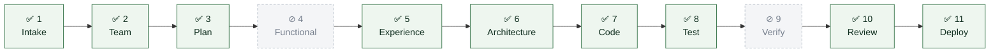

# Portfolio status — all projects

Where every project stands in its journey, at a glance.

Regenerated by the orchestrator whenever any project crosses a gate, and on
demand via **`/ProjectStatus`** (no argument = this whole view; with a project
name = that project's detail).

Notation and gate definitions: `admin/PIPELINE.md`.
Per-project detail: `projects/<name>/PIPELINE_LOG.md`.

**Last regenerated**: 2026-07-28

---

## At a glance

| Project | Template | Position | Env | Gates run | Last activity |
|---|---|---|---|---|---|
| [grid-assistant](#grid-assistant) | genai-chatbot | Released `v1.0.0` | prod | 9 of 9 *(pre-11)* | 2026-07-09 |
| [load-alert-agent](#load-alert-agent) | agentic-workflow | Released `v1.0.0` | prod | 8 of 9 *(core-only)* | 2026-07-09 |
| [policy-lookup-assistant](#policy-lookup-assistant) | rag-knowledge-base | Deployed | dev, local | 9 of 9 *(pre-11)* | 2026-07-09 |
| [conclave-marketing](#conclave-marketing) | custom (FastAPI) | Deployed | dev, local | 9 of 9 *(pre-11)* | 2026-07-17 |
| [little-milestones](#little-milestones) | genai-chatbot | Deployed + post-deploy fixes | dev, local | 7 of 11 | **2026-07-28** |

> **All five predate the 11-gate pipeline.** Functional Design and Verification
> were added 2026-07-28 and show as `⊘` throughout — the gates did not exist
> when these ran. That is a real coverage gap, not a formatting artefact: none
> of these projects has acceptance criteria with stable IDs, and none has had
> its evidence trail audited against them. Any future enhancement to any of
> them runs the full 11.

---

## grid-assistant

**genai-chatbot · released `v1.0.0` to `prod/` · first project through the full lifecycle**

```mermaid
flowchart LR
  G1["✅ 1<br/>Intake"] --> G2["✅ 2<br/>Team"] --> G3["✅ 3<br/>Plan"]
  G3 --> G4["⊘ 4<br/>Functional"] --> G5["✅ 5<br/>Experience"]
  G5 --> G6["✅ 6<br/>Architecture"] --> G7["✅ 7<br/>Code"] --> G8["✅ 8<br/>Test"]
  G8 --> G9["⊘ 9<br/>Verify"] --> G10["✅ 10<br/>Review"] --> G11["✅ 11<br/>Deploy"]
  G11 --> REL(["🏷 released v1.0.0"])

  classDef done    fill:#eef6ef,stroke:#2f6f43,color:#123021
  classDef skipped fill:#f4f5f7,stroke:#b8bfc9,color:#767f8d,stroke-dasharray:4 3
  class G1,G2,G3,G5,G6,G7,G8,G10,G11,REL done
  class G4,G9 skipped
```

Two features shipped. The first project to exercise the whole lifecycle
including `enhance-agent` and `release-manager`.

---

## load-alert-agent

**agentic-workflow · released `v1.0.0` to `prod/` · deliberate core-only run**

```mermaid
flowchart LR
  G1["✅ 1<br/>Intake"] --> G2["✅ 2<br/>Team"] --> G3["✅ 3<br/>Plan"]
  G3 --> G4["⊘ 4<br/>Functional"] --> G5["⊘ 5<br/>Experience"]
  G5 --> G6["✅ 6<br/>Architecture"] --> G7["✅ 7<br/>Code"] --> G8["✅ 8<br/>Test"]
  G8 --> G9["⊘ 9<br/>Verify"] --> G10["✅ 10<br/>Review"] --> G11["✅ 11<br/>Deploy"]
  G11 --> REL(["🏷 released v1.0.0"])

  classDef done    fill:#eef6ef,stroke:#2f6f43,color:#123021
  classDef skipped fill:#f4f5f7,stroke:#b8bfc9,color:#767f8d,stroke-dasharray:4 3
  class G1,G2,G3,G6,G7,G8,G10,G11,REL done
  class G4,G5,G9 skipped
```

Experience Design is `⊘` **correctly** — `agentic-workflow` is API-only, so the
gate is not applicable by template rather than skipped. Also the project where
real conflict resolution was proven, with two intentionally conflicting
features.

---

## policy-lookup-assistant

**rag-knowledge-base · deployed (dev, local) · full-SME verification run**

The run that validated all five SMEs engaged at once. Not promoted to `prod/`.

---

## conclave-marketing

**custom (FastAPI marketing site) · deployed (dev, local) · F1–F12 live at :8100**

F13 (a real contact address) deferred and human-owned. Multi-page: Home /
Solutions / Contact.

---

## little-milestones

**genai-chatbot · deployed (dev, local) · the project the platform's current shape came from**

```mermaid
flowchart LR
  G1["✅ 1<br/>Intake"] --> G2["✅ 2<br/>Team"] --> G3["✅ 3<br/>Plan"]
  G3 --> G4["⊘ 4<br/>Functional"] --> G5["✅ 5<br/>Experience"]
  G5 --> G6["⚠ 6<br/>Architecture"] --> G7["✅ 7<br/>Code"] --> G8["⚠ 8<br/>Test"]
  G8 --> G9["⊘ 9<br/>Verify"] --> G10["⊘ 10<br/>Review"] --> G11["✅ 11<br/>Deploy"]
  G11 --> FIX["↩ 8 human-found<br/>defects → Code"]
  FIX -.-> G7

  classDef done    fill:#eef6ef,stroke:#2f6f43,color:#123021
  classDef warn    fill:#fff8e6,stroke:#8a6410,stroke-width:2px,color:#3d2c04
  classDef looped  fill:#fdf0ec,stroke:#a3341f,stroke-width:2px,color:#3d1109
  classDef skipped fill:#f4f5f7,stroke:#b8bfc9,color:#767f8d,stroke-dasharray:4 3
  class G1,G2,G3,G5,G7,G11 done
  class G6,G8 warn
  class G4,G9,G10 skipped
  class FIX looped
```

F1–F17 web + **F18 native mobile** (React Native/Expo). **499 tests green**
across backend / desktop web / mobile / six SME suites.

Two gates are `⚠`, not `✅`, and one `⊘` is not a template exclusion:

- **Architecture** ran but the mobile design landed in `SECURITY_KB §9` and
  `UX_KB §13`, never in `ARCHITECTURE_KB.md`. Closed retrospectively 2026-07-28.
- **Test** ran with the rendered-UI contract live but no native backend —
  Playwright cannot load a React Native tree — so six rendering defects were
  structurally uncatchable. RNTL backend added 2026-07-28.
- **Review** was skipped by the orchestrator with no human exception requested.
  Recorded in `projects/little-milestones/PIPELINE_LOG.md`.

Eight loop-backs, **seven originated by the human on the running app.**
Outstanding: night theme, offline queue.

---

## What this view is for

The summary table answers "where is everything?" The per-project graphs answer
"how did it get there, and what was skipped?" — which is the question that
actually matters, because a green `✅` and a `⊘` look equally finished in prose
and are not remotely the same thing.
