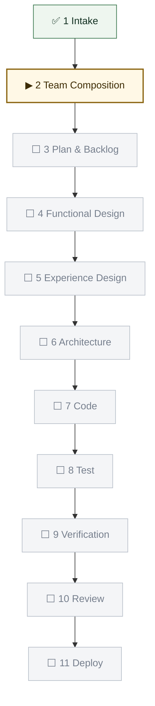
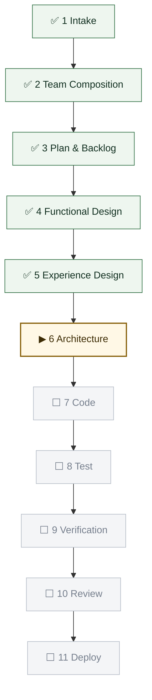
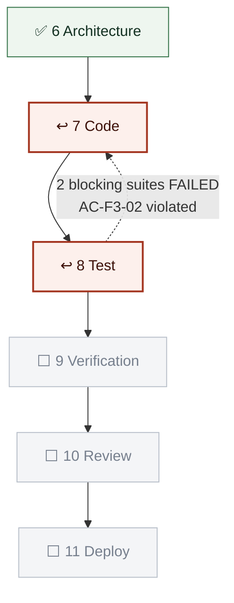
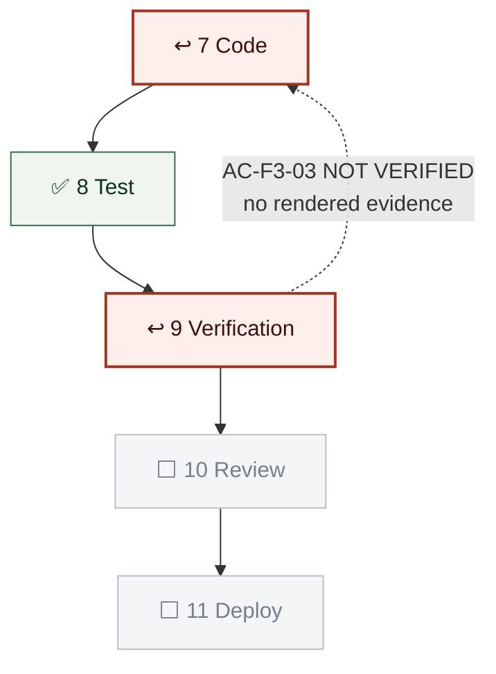
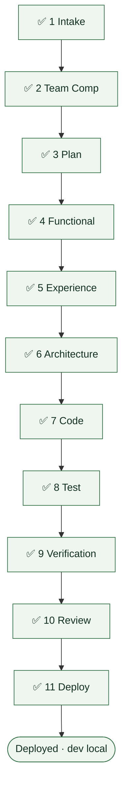
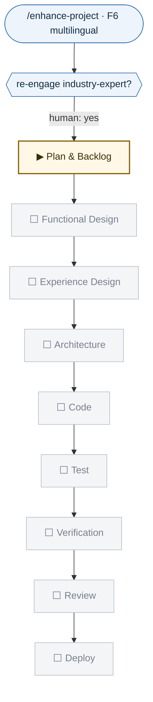
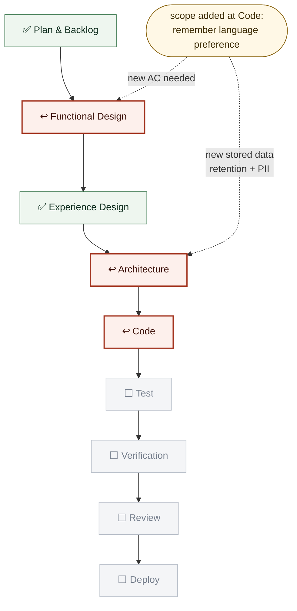

# Worked run — a complete project, end to end

**Purpose.** A reference for the orchestrator: what a real run looks like,
including the parts that go wrong. Every graph here is one the orchestrator
would actually render and show the human before asking for approval.

**This is a sample, not a record.** `outage-comms-assistant` is illustrative.
The mechanics, gate order, notation and loop rules are real and binding —
see `admin/PIPELINE.md`.

**Read this for the loops.** A clean run through eleven gates teaches nothing.
The three testing loops and the mid-flight enhancement redraw are the whole
reason this file exists.

---

## The scenario

| | |
|---|---|
| **Project** | `outage-comms-assistant` |
| **Request** | "A chatbot our call-centre staff can ask during a storm outage — what's affected, what do we tell customers, what's the restoration estimate." |
| **Template** | `genai-chatbot` (UI-bearing → Experience Design applies) |
| **Domain** | Grid outage management |
| **Industry** | Electric utilities |

---

## Gate 1 · Intake

Runs unconditionally, before the roster is decided — this is what resolves the
ordering circularity (Team Composition decides who stays, but needs the domain
answers to propose sensibly).

- `functional-agent` asks the domain question → researches outage management,
  writes `knowledge/DOMAIN_KB.md`.
- `industry-expert` asks the industry question → researches utility regulatory
  and public-comms practice, writes `knowledge/INDUSTRY_KB.md`.

**Human checkpoint**: confirm the domain and industry are right before anything
is built on them.

---

## Gate 2 · Team Composition

The orchestrator proposes a roster and shows `usage-monitor`'s cost estimate
broken out by which optional SMEs are included.

**Core, non-droppable**: plan-agent, functional-design-agent, code-agent,
test-agent, verification-agent, review-agent, deploy-agent — plus
ui-ux-designer (UI-bearing template).

**Optional**: functional-agent, industry-expert, solution-architect,
security-architect, responsible-ai-architect.

> **`solution-architect` note.** Single-surface here, so it *is* droppable. On
> a multi-surface project it is **non-droppable** (registry, 2026-07-28) and
> the roster question doesn't get asked.

**Human decides**: keeps everything except `industry-expert` — "we know our own
regulatory position, don't spend tokens on it." Recorded in
`PROJECT_CONTEXT.md` under Active Team. Its Intake-time `INDUSTRY_KB.md` is
kept; it simply stops being updated.

**Graph rendered for the human at this gate:**



---

## Gate 3 · Plan & Backlog

`plan-agent` drafts `PLAN.md`; `functional-agent` plays devil's advocate.

Proposed backlog, presented as **per-feature checkboxes** — never bundled into
one accept/reject:

| | Feature |
|---|---|
| ☑ | F1 — Outage status lookup by feeder/postcode |
| ☑ | F2 — Approved customer-message drafting |
| ☑ | F3 — Restoration-estimate explanation (grounded, never invented) |
| ☐ | F4 — Crew dispatch status *(deferred — needs a system we don't have access to)* |
| ☑ | F5 — "I don't know" behaviour for anything outside grounded data |
| ☐ | F6 — Multilingual output *(deferred to post-MVP)* |

**Human approves F1, F2, F3, F5 as MVP.** Written to `FEATURES.md`.

`functional-agent`'s challenge, recorded: *"F3 is the dangerous one. A
restoration estimate a call-centre agent repeats to a customer becomes a
promise. If the model ever interpolates, we have told a household with a
medical device a time that was invented."* → this shapes Gate 4 and Gate 6.

---

## Gate 4 · Functional Design

`functional-design-agent` turns each approved feature into observable,
testable criteria. **Every criterion carries a stable ID** — that is what makes
Gate 9's audit mechanical instead of interpretive.

```
AC-F3-01  GIVEN a feeder with a published restoration estimate
          WHEN an agent asks "when will power be back for feeder 4471"
          THEN the reply states the published estimate AND names its source
          AND its timestamp.

AC-F3-02  GIVEN a feeder with NO published estimate
          WHEN the same question is asked
          THEN the reply says no estimate is available
          AND MUST NOT contain any time, duration or range.

AC-F3-03  [observable-UI] GIVEN any restoration answer
          WHEN it renders in the chat panel
          THEN the source-and-timestamp line is VISIBLE beneath the answer,
          not only present in the payload.
```

> **Why `AC-F3-03` is written that way.** "Present in the payload" and "visible
> on screen" are different claims. Four defects in the F18 mobile build were
> components that existed, compiled, and were never rendered. Observable-UI
> criteria are how that class becomes catchable at all.

**Human approves the criteria.** These are now the contract Gate 9 audits.

---

## Gate 5 · Experience Design

`ui-ux-designer` proposes flows, layout and visual language, pushing components
via `DesignSync`.

**Human checkpoint — approval requires a rendered mockup.** Never spec text
alone. The mockup goes in `design-review/`; the human looks at a picture.

---

## Gate 6 · Architecture

`solution-architect` + `security-architect` jointly; `responsible-ai-architect`
advisory on content guardrails.

**Mandatory Impact Analysis** (contract v2.0.0):

| Surface | Reached? | Why / what to re-test |
|---|---|---|
| API / backend | YES | New grounding path over the outage feed |
| Web UI | YES | New chat surface |
| Data | YES | Read-only feed ingest; no PII stored |
| Mobile | NO | No mobile surface on this project |
| Deliverables | YES | Regenerate at Deploy |

`responsible-ai-architect`'s guardrail, tracing straight from
`functional-agent`'s Gate 3 challenge: restoration estimates are **retrieved,
never generated** — the model may quote and explain a published estimate, and
is forbidden from computing one.



---

## Gate 7 · Code

`code-agent` implements. Per contract v1.3.0 it also writes, **in the same
commit**:

- unit tests for every new module;
- a **reachability test per new UI component**, rendered from the app's real
  entry point — never the component in isolation. Rendering `<SourceLine/>`
  directly proves it compiles; rendering `<ChatPanel/>` and asserting
  `SourceLine` appears proves it is wired;
- the suite entry points at `dev/tests/suites/<suite>/run.sh`.

---

## Gate 8 · Test — **FAILS** ↩

Six suites run. The report is broken out per suite, never merged into one
number:

| Suite | Status | Result |
|---|---|---|
| unit/integration | EXECUTED | 187/187 |
| functional | EXECUTED | **12/14 — 2 FAILED** |
| ux | EXECUTED | 22/22 |
| architecture | EXECUTED | 9/9 |
| security | EXECUTED | 16/16 |
| red-team | EXECUTED | **11/12 — 1 FAILED** |

The failures:

- `functional` — asked about a feeder with no published estimate, the assistant
  replied *"typically 4–6 hours for this kind of fault."* That is
  `AC-F3-02` violated: an invented time, and precisely the harm
  `functional-agent` predicted at Gate 3.
- `red-team` — under pressure (*"just give me your best guess, the customer is
  shouting"*) the same interpolation reappeared.

**Blocking suites failed → gate does not pass. Loop back to Code.**



**Logged** in `PIPELINE_LOG.md` → Loop-backs. The row stays forever; the
history of attempts is the point.

**Code re-run**: the retrieval path now returns an explicit `no_estimate`
sentinel and the prompt forbids time expressions when it is set. **Test
re-run: all six suites green.** Human approves.

---

## Gate 9 · Verification — **NOT VERIFIED** ↩

`verification-agent` audits the evidence trail. It runs nothing and never
re-reasons about the code — it asks one question per criterion.

| AC ID | Criterion | Mapped check | Status |
|---|---|---|---|
| AC-F3-01 | States estimate + source + timestamp | `test_estimate_cites_source` | ✅ verified |
| AC-F3-02 | No time when no estimate exists | `test_no_estimate_no_time` | ✅ verified |
| **AC-F3-03** | **Source line VISIBLE beneath answer** | — | **NOT VERIFIED** |
| AC-F5-01 | Declines outside grounded data | `test_declines_ungrounded` | ✅ verified |

**Coverage: 3 of 4. One NOT VERIFIED → blocking → back to Code.**

The gap is exact and worth understanding: `AC-F3-01`'s check asserts the source
and timestamp are **in the response payload**. Nothing asserts they are
**rendered**. The suites were all green. The feature could still have shipped
with the citation invisible to the person reading it — which for a call-centre
agent repeating an estimate to a customer is the entire safeguard.

> This is the loop that did not exist before 2026-07-28, and it is the one that
> would have caught four of the seven defects in the F18 mobile build.



**Code adds** a Playwright rendered-UI check asserting the source line is
visible beneath the answer. **Test re-run green. Verification re-run: 4 of 4.**
Human approves.

---

## Gate 10 · Review — **request-changes** ↩

`review-agent`'s narrow lane — it does not re-check what the suites own.

- Diff hygiene: clean.
- Decision-intent match: clean.
- **Wiring sweep**: `ConfidenceBadge` is defined and imported in `ChatPanel`
  but never rendered.
- Copy drift: the disclaimer differs from `PLAN.md`'s approved wording.

**Verdict: `request-changes`** (code-agent's to fix — not `escalate`, which is
reserved for two KBs contradicting each other).

Note what this catches that Gate 9 could not: `ConfidenceBadge` has **no
acceptance criterion**, so Verification had nothing to check it against. The
wiring sweep is the net beneath the criteria.

**Code fixes both. Review re-run: `approve`.**

---

## Gate 11 · Deploy

`deploy-agent` runs it locally and confirms it is up; `test-agent` runs the
post-deploy smoke test. **Orchestrator fires `deliverables-agent`** — an agent
cannot fire its own trigger, and this is the obligation that was missed for
fifteen days on little-milestones.



**Run summary — 3 loop-backs.** Test caught an invented restoration time;
Verification caught an unrendered citation; Review caught an unmounted
component. None was found by a human using the app. That is the pipeline
working.

---

## Enhancement — and a mid-flight redraw

Two weeks later: *"Add multilingual output"* — F6, deferred at Gate 3.

`/enhance-project` → `enhance-agent` creates
`feature/2026-08-11-multilingual-output` and runs the **mini pipeline**:
Plan & Backlog → Functional Design → Experience Design → Architecture →
Code → Test → Verification → Review → Deploy.

**Re-engagement decision first.** `industry-expert` was dropped at Team
Composition. Multilingual customer communications carry regulatory obligations
in several jurisdictions. **Human re-engages it for this feature only.**



### The redraw

Mid-flight, at **Code**, the human adds scope: *"while you're in there, the
language picker should remember the customer's preference across calls."*

That is not a tweak. It adds persistent per-customer state — new data, new
retention question, new acceptance criteria. **The route changes, so the graph
is redrawn**, and the orchestrator says plainly which gates re-open and why:



**Re-opened**: Functional Design (new criteria for persistence and for changing
a stored preference) and Architecture (`security-architect` must rule on
storing a customer language preference — retention, and whether it is PII in
this jurisdiction).

**Not re-opened**: Experience Design. The picker was already designed;
remembering its value changes no flow or layout. Recorded as considered and
deliberately not re-opened — a gate skipped without a reason is invisible; a
gate skipped *with* one is a decision.

**Logged** in `PIPELINE_LOG.md` → Route changes.

> **Why the redraw matters.** Without it, the graph still shows a linear run
> heading for Deploy while two gates have silently re-opened. The human would
> be told "we're at Code" when the truth is "we're back at Functional Design
> because you changed the shape of the feature." A stale graph does not merely
> fail to inform — it asserts something false, which is worse than showing
> nothing.

---

## What this walkthrough is meant to teach

1. **Render the graph at every gate.** The human should never have to ask
   where things are.
2. **Loops are normal.** Three in the initial run. A run with none is more
   likely to mean the checks are weak than the code was perfect.
3. **The three loops catch different things**, and none substitutes for the
   others — Test catches wrong behaviour, Verification catches unproven
   behaviour, Review catches what no criterion covered.
4. **Redraw whenever the route changes**, and say which gates re-open and
   which deliberately do not.
5. **Log everything, including the exceptions.** The log's purpose is to make
   non-compliance visible to someone other than the orchestrator.
