# Pipeline Log — `<project-name>`

Live record of this project's passage through the gates. Created by the
orchestrator at project start, updated at **every** gate close, and re-rendered
whenever the route changes.

Canonical gate definitions: `admin/PIPELINE.md`.
Read by `review-agent` at Review and `release-manager` at `/cut-release` — a
gap in this log is a finding, not a formatting issue.

---

## Current position

> Re-render this block at every gate. Delete the placeholder states and set
> the real ones. Class definitions are fixed in `admin/PIPELINE.md` §3 — copy
> them verbatim so every render across every project looks the same.

```mermaid
flowchart LR
  G1["✅ 1<br/>Intake"] --> G2["▶ 2<br/>Team"] --> G3["⬜ 3<br/>Plan"]
  G3 --> G4["⬜ 4<br/>Functional"] --> G5["⬜ 5<br/>Experience"]
  G5 --> G6["⬜ 6<br/>Architecture"] --> G7["⬜ 7<br/>Code"] --> G8["⬜ 8<br/>Test"]
  G8 --> G9["⬜ 9<br/>Verify"] --> G10["⬜ 10<br/>Review"] --> G11["⬜ 11<br/>Deploy"]

  classDef done    fill:#eef6ef,stroke:#2f6f43,color:#123021
  classDef active  fill:#fff8e6,stroke:#8a6410,stroke-width:2px,color:#3d2c04
  classDef looped  fill:#fdf0ec,stroke:#a3341f,stroke-width:2px,color:#3d1109
  classDef pending fill:#f4f5f7,stroke:#b8bfc9,color:#767f8d
  classDef skipped fill:#f4f5f7,stroke:#b8bfc9,color:#767f8d,stroke-dasharray:4 3
  class G1 done
  class G2 active
  class G3,G4,G5,G6,G7,G8,G9,G10,G11 pending
```

**Run**: `<new-project | enhance-project | modify-feature>` · **Started**: `<YYYY-MM-DD>`
**Now at**: `<gate N · name>` — `<awaiting human approval | running | blocked>`

---

## Gate ledger

One row per gate **close**. A gate that loops back gets a new row on each
re-run — the history of attempts is the point, so never overwrite a row.

| # | Gate | Date | Participants | Artifacts produced | Approval | Notes / exceptions |
|---|------|------|--------------|--------------------|----------|--------------------|
| 1 | Intake | | | | | |
| 2 | Team Composition | | | | | |
| 3 | Plan & Backlog | | | | | |
| 4 | Functional Design | | | | | |
| 5 | Experience Design | | | | | |
| 6 | Architecture | | | | | |
| 7 | Code | | | | | |
| 8 | Test | | | | | |
| 9 | Verification | | | | | |
| 10 | Review | | | | | |
| 11 | Deploy | | | | | |

**Approval column** takes exactly one of: `approved` · `approved [override]` ·
`request-changes` · `escalate` · `skipped (recorded)` · `exception (human)`.
Anything else means the row is not finished.

---

## Loop-backs

Every time work is sent back. This table is the honest measure of how much the
gates are actually catching.

| Date | From gate | Back to | Reason | Resolved |
|------|-----------|---------|--------|----------|
| | | | | |

---

## Exceptions granted

A gate skipped or reordered on explicit human instruction. **The orchestrator
may not grant itself an exception** — every row here needs a human ask.

| Date | Gate | What was skipped | Human's reason | Requested by |
|------|------|------------------|----------------|--------------|
| | | | | |

---

## Route changes

When the shape of the run itself changed — scope added mid-flight, an SME
re-engaged, gates re-opened. Each entry means the graph above was redrawn.

| Date | What changed | Gates re-opened | Redrawn |
|------|--------------|-----------------|---------|
| | | | |
