# Pipeline Log — `conclave-dashboard`

Canonical definitions: `admin/PIPELINE.md`. Intake record: `INTAKE.md`.

> **First project to run all eleven gates.** Both Functional Design and
> Verification get their first real exercise here — on tooling that will itself
> become a source of truth. Recorded as a known risk at Team Composition rather
> than discovered at gate 9.

---

## Current position

**Run**: `new-project` (custom Flask) · **Started**: 2026-07-28
**Now at**: gate 2 · Team Composition — **awaiting your approval**

```mermaid
flowchart TB
  subgraph r1 [" "]
    direction LR
    G1["✅ 1<br/>Intake"] --> H1{"✋<br/>approved"} --> G2["▶ 2<br/>Team"] --> H2{"✋ YOU<br/>approve?"} --> G3["⬜ 3<br/>Plan"] --> H3{"✋<br/>—"}
  end
  subgraph r2 [" "]
    direction LR
    G4["⬜ 4<br/>Functional"] --> H4{"✋<br/>—"} --> G5["⬜ 5<br/>Experience"] --> H5{"✋<br/>—"} --> G6["⬜ 6<br/>Architecture"] --> H6{"✋<br/>—"}
  end
  subgraph r3 [" "]
    direction LR
    G7["⬜ 7<br/>Code"] --> H7{"✋<br/>—"} --> G8["⬜ 8<br/>Test"] --> H8{"✋<br/>—"} --> G9["⬜ 9<br/>Verify"] --> H9{"✋<br/>—"}
  end
  subgraph r4 [" "]
    direction LR
    G10["⬜ 10<br/>Review"] --> H10{"✋<br/>—"} --> G11["⬜ 11<br/>Deploy"] --> H11{"✋<br/>—"}
  end
  H3 --> G4
  H6 --> G7
  H9 --> G10
  classDef done    fill:#eef6ef,stroke:#2f6f43,color:#123021
  classDef active  fill:#fff8e6,stroke:#8a6410,stroke-width:2px,color:#3d2c04
  classDef looped  fill:#fdf0ec,stroke:#a3341f,stroke-width:2px,color:#3d1109
  classDef warn    fill:#fff8e6,stroke:#8a6410,stroke-width:2px,color:#3d2c04
  classDef pending fill:#f4f5f7,stroke:#b8bfc9,color:#767f8d
  classDef skipped fill:#f4f5f7,stroke:#b8bfc9,color:#767f8d,stroke-dasharray:4 3
  classDef hdone   fill:#dcefe2,stroke:#2f6f43,color:#123021
  classDef hwait   fill:#ffe9a8,stroke:#8a6410,stroke-width:4px,color:#3d2c04
  classDef hpend   fill:#fafbfc,stroke:#cfd5dd,color:#98a1ad,stroke-dasharray:3 3
  classDef rowbox  fill:none,stroke:none
  class G1 done
  class H1 hdone
  class G2 active
  class H2 hwait
  class G3,G4,G5,G6,G7,G8,G9,G10,G11 pending
  class H3,H4,H5,H6,H7,H8,H9,H10,H11 hpend
  class r1,r2,r3,r4 rowbox
```

---

## Gate ledger

| # | Gate | Date | Participants | Artifacts produced | Approval | Notes / exceptions |
|---|------|------|--------------|--------------------|----------|--------------------|
| 1 | Intake | 2026-07-28 | orchestrator, mas-architect | `INTAKE.md` (full form, Path A) | approved | First run of the mandatory intake process. It immediately caught a live ambiguity — "live status" meant pipeline **and** runtime, unresolved until asked |
| 2 | Team Composition | 2026-07-28 | orchestrator, usage-monitor | Roster + estimate below | **awaiting** | `industry-expert` N/A (internal tooling). `solution-architect` droppable by rule (single surface) but recommended kept |
| 3–11 | | | | | | |

---

## Loop-backs

| Date | From gate | Back to | Reason | Resolved |
|------|-----------|---------|--------|----------|
| | | | | |

---

## Exceptions granted

| Date | Gate | What was skipped | Human's reason | Requested by |
|------|------|------------------|----------------|--------------|
| | | | | |

---

## Route changes

| Date | What changed | Gates re-opened | Redrawn |
|------|--------------|-----------------|---------|
| 2026-07-28 | Began as an `admin/` platform feature; `mas-architect` rejected that framing and the human agreed. Became a project. | None — the change landed at gate 2, before any design work | ✅ above; prior log closed at `admin/PIPELINE_LOG.md` |
