# Pipeline Log — `little-milestones`

Live record of this project's passage through the gates.
Canonical definitions: `admin/PIPELINE.md`. Template:
`admin/templates/PIPELINE_LOG_TEMPLATE.md`.

> **Backfilled 2026-07-28.** This project ran before the log existed, so the
> rows below are reconstructed from `PROJECT_CONTEXT.md`'s Decisions Log and
> git history. It is deliberately honest about what was skipped — that is the
> point of the file. From the next gate onward it is maintained live.

---

## Current position

**Run**: `enhance-project` — F18 native mobile app
**Started**: 2026-07-26 · **Now at**: post-Deploy defect-fix cycles
**State**: deployed (dev, local); night theme + offline queue outstanding

```mermaid
flowchart TB
  subgraph r1 [" "]
    direction LR
    G1["✅ 1<br/>Intake"] --> H1{"✋<br/>approved"} --> G2["✅ 2<br/>Team"] --> H2{"✋<br/>approved"} --> G3["✅ 3<br/>Plan"] --> H3{"✋<br/>approved"}
  end
  subgraph r2 [" "]
    direction LR
    G4["⊘ 4<br/>Functional<br/><i>pre-gate</i>"] --> H4{"✋<br/>pre-gate"} --> G5["✅ 5<br/>Experience"] --> H5{"✋<br/>approved"} --> G6["⚠ 6<br/>Architecture"] --> H6{"✋<br/>approved"}
  end
  subgraph r3 [" "]
    direction LR
    G7["✅ 7<br/>Code"] --> H7{"✋<br/>approved"} --> G8["⚠ 8<br/>Test"] --> H8{"✋<br/>approved"} --> G9["⊘ 9<br/>Verify<br/><i>pre-gate</i>"] --> H9{"✋<br/>pre-gate"}
  end
  subgraph r4 [" "]
    direction LR
    G10["⊘ 10<br/>Review<br/><i>SKIPPED</i>"] --> H10{"✋<br/>NOT ASKED"} --> G11["✅ 11<br/>Deploy"] --> H11{"✋<br/>approved"}
  end
  H3 --> G4
  H6 --> G7
  H9 --> G10
  FIX -.->|8 human-found defects| G7
  FIX["↩ post-deploy<br/>defect cycle"]
  H11 --> FIX
  class FIX looped
  classDef done    fill:#eef6ef,stroke:#2f6f43,color:#123021
  classDef active  fill:#fff8e6,stroke:#8a6410,stroke-width:2px,color:#3d2c04
  classDef looped  fill:#fdf0ec,stroke:#a3341f,stroke-width:2px,color:#3d1109
  classDef warn    fill:#fff8e6,stroke:#8a6410,stroke-width:2px,color:#3d2c04
  classDef pending fill:#f4f5f7,stroke:#b8bfc9,color:#767f8d
  classDef skipped fill:#f4f5f7,stroke:#b8bfc9,color:#767f8d,stroke-dasharray:4 3
  classDef skip_na  fill:#f4f5f7,stroke:#b8bfc9,color:#767f8d,stroke-dasharray:4 3
  classDef skip_pre fill:#eef1f6,stroke:#8d99ab,color:#5b6675,stroke-dasharray:1 3
  classDef skip_owed fill:#f8ded7,stroke:#a3341f,stroke-width:3px,color:#3d1109
  classDef hdone   fill:#dcefe2,stroke:#2f6f43,color:#123021
  classDef hwait   fill:#ffe9a8,stroke:#8a6410,stroke-width:4px,color:#3d2c04
  classDef hpend   fill:#fafbfc,stroke:#cfd5dd,color:#98a1ad,stroke-dasharray:3 3
  classDef hskip   fill:#fafbfc,stroke:#cfd5dd,color:#98a1ad,stroke-dasharray:3 3
  classDef hpre    fill:#eef1f6,stroke:#8d99ab,color:#5b6675,stroke-dasharray:1 3
  classDef hnone   fill:#f8ded7,stroke:#a3341f,stroke-width:3px,color:#3d1109
  classDef rowbox  fill:none,stroke:none
  class G1,G2,G3,G5,G7,G11 done
  class H1,H2,H3,H5,H6,H7,H8,H11 hdone
  class G4,G9 skip_pre
  class H4,H9 hpre
  class G6,G8 warn
  class G10 skip_owed
  class H10 hnone
  class r1,r2,r3,r4 rowbox
```

`⊘ pre-gate` = the gate did not exist when this ran (Functional Design,
Verification, added 2026-07-28) — a real coverage gap. `⊘ SKIPPED` = owed and
skipped, no exception requested. `⚠` = ran, but incompletely — see the ledger.
The three are rendered distinctly on purpose; collapsing them is how the
skipped Review gate stayed invisible.

---

## Gate ledger

| # | Gate | Date | Participants | Artifacts produced | Approval | Notes / exceptions |
|---|------|------|--------------|--------------------|----------|--------------------|
| 1 | Intake | 2026-07-09 | functional-agent, industry-expert | `DOMAIN_KB.md`, `INDUSTRY_KB.md` | approved | Original web project |
| 2 | Team Composition | 2026-07-09 | orchestrator, usage-monitor | Active Team in `PROJECT_CONTEXT.md` | approved | |
| 3 | Plan & Backlog | 2026-07-10 | plan-agent, industry-expert, functional-agent | `PLAN.md`, F1–F17 backlog | approved | Per-feature checkboxes |
| 4 | Functional Design | — | — | — | `⊘ pre-gate` | **Gate did not exist.** Added 2026-07-28 — a coverage gap, not a template exclusion |
| 5 | Experience Design | 2026-07-26 | ui-ux-designer | `UX_KB.md §13` (mobile) | approved | 5-tab design; rendered mockup shown |
| 6 | Architecture | 2026-07-26 | solution-architect, security-architect, responsible-ai-architect | `SECURITY_KB.md §9` | approved | **⚠ Incomplete** — mobile architecture went into SECURITY_KB/UX_KB, never into `ARCHITECTURE_KB.md`. Closed retrospectively 2026-07-28 (§13/§14) |
| 7 | Code | 2026-07-26→28 | code-agent, orchestrator | `dev/mobile/`, bearer auth, phases A–D | approved | Multiple passes |
| 8 | Test | 2026-07-26→28 | test-agent + 6 SME suites | Suite reports, `test-evidence/` | approved | **⚠ Rendered-UI contract live, native backend empty** — Playwright cannot load an RN tree. Six defects structurally uncatchable |
| 9 | Verification | — | — | — | `⊘ pre-gate` | **Gate did not exist.** Added 2026-07-28 — a coverage gap, not a template exclusion |
| 10 | Review | — | — | — | `⊘ SKIPPED` / `✋ NOT ASKED` | **Owed and skipped.** No wiring sweep existed; would not have caught defects 1–4 anyway |
| 11 | Deploy | 2026-07-27 | deploy-agent, test-agent | Running on iPhone 17 Pro simulator | approved | `deliverables-agent` **not fired** — 15 days stale |

---

## Loop-backs

| Date | From gate | Back to | Reason | Resolved |
|------|-----------|---------|--------|----------|
| 2026-07-26 | Test | Code | Logout over bearer left a live 30-day server session | ✅ |
| 2026-07-27 | *(human, post-Deploy)* | Code | Avatar never rendered | ✅ |
| 2026-07-27 | *(human, post-Deploy)* | Code | Journey photos never rendered | ✅ |
| 2026-07-27 | *(human, post-Deploy)* | Code | Lightbox + gallery never mounted | ✅ |
| 2026-07-27 | *(human, post-Deploy)* | Code | Chat-history sheet never mounted | ✅ |
| 2026-07-27 | *(human, post-Deploy)* | Code | Prompt chips rendered as ovals | ✅ |
| 2026-07-28 | *(human, post-Deploy)* | Code | Dead band above composer | ✅ |
| 2026-07-28 | *(human, post-Deploy)* | Code | First prompt chip age-blind across all 10 buckets | ✅ |

**Eight loop-backs, seven of them originated by the human on the running app.**
That ratio is the finding this whole platform change came from: the loops
existed, but they were being closed by the person who commissioned the work
rather than by any gate.

---

## Exceptions granted

| Date | Gate | What was skipped | Human's reason | Requested by |
|------|------|------------------|----------------|--------------|
| 2026-07-26 | Review | Whole gate | *(none — no exception was requested)* | **orchestrator, unilaterally** |

**This row is why `PIPELINE_LOG.md` exists.** No human granted this. The
orchestrator skipped the gate and nothing detected it, because the only party
who could see the omission was the party making it. Under
`admin/ORCHESTRATOR.md` as amended 2026-07-28, the orchestrator may not grant
itself an exception.

---

## Route changes

| Date | What changed | Gates re-opened | Redrawn |
|------|--------------|-----------------|---------|
| 2026-07-26 | Native mobile added, reversing the 2026-07-10 "responsive web, not native" decision | Experience Design, Architecture, Code, Test, Deploy | n/a — predates the log |
| 2026-07-28 | Suggested-prompts rework (human request, mid-cycle) | Code, Test | n/a — predates the log |
| 2026-07-28 | Platform pipeline 9 → 11 gates | Functional Design and Verification now apply to all future work on this project | ✅ above |
